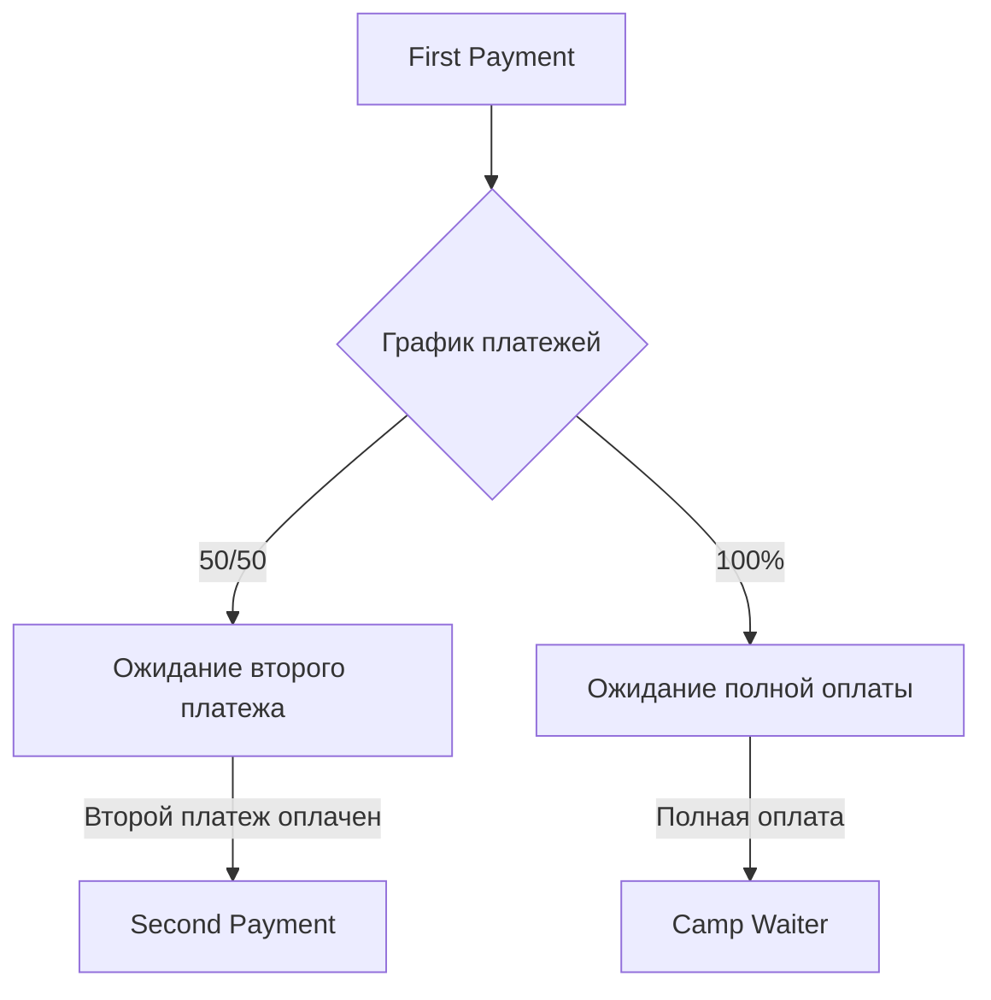

# 014-crm-status-automation

## Автоматическое изменение статусов CRM сделок на основе оплаты проформ

### Обзор

Система автоматически изменяет статусы сделок в Pipedrive CRM на основе оплаты проформ, упрощая работу и обеспечивая синхронизацию между финансовой системой и CRM.

### Бизнес-контекст

В текущем процессе пользователь вручную изменяет статусы в CRM после оплаты, что создает двойную работу и риск несоответствий. Автоматизация этого процесса позволит:

- Исключить человеческий фактор
- Обеспечить консистентность данных
- Сэкономить время пользователей
- Улучшить аналитику и отчетность

### Логика работы

#### Исходные статусы
- **18 "First Payment"** - начальный статус для сделок
- **32 "Second Payment"** - для сделок с двумя платежами в графике
- **27 "Camp Waiter"** - для сделок с одним платежом в графике

#### Правила перехода
1. **Сделка с двумя платежами (50/50):**
   - Начальный статус: "First Payment"
   - После оплаты первого платежа: остается "First Payment"
   - После оплаты второго платежа: меняется на "Second Payment"

2. **Сделка с одним платежом (100%):**
   - Начальный статус: "First Payment"
   - После полной оплаты: меняется на "Camp Waiter"

#### Правила для частичных платежей
- Суммирование частичных оплат
- Изменение статуса при достижении порога (>=50% для "Second Payment")
- Обработка нескольких платежей на одну сделку

### Функциональные требования

#### FR-001: Мониторинг оплаты проформ
**Описание:** Система ДОЛЖНА отслеживать оплату проформ в реальном времени.

**Критерии приемки:**
- Мониторинг таблицы `proformas` на изменения в полях оплаты
- Обработка webhook от Stripe для мгновенных обновлений
- Проверка оплаты банковских платежей через регулярные проверки

#### FR-002: Определение графика платежей
**Описание:** Система ДОЛЖНА определять график платежей для каждой сделки.

**Критерии приемки:**
- Анализ поля `payment_schedule` в проформе
- Поддержка графиков "50/50", "100%", "70/30"
- Определение количества платежей в графике

#### FR-003: Расчет статуса оплаты
**Описание:** Система ДОЛЖНА рассчитывать текущий уровень оплаты сделки.

**Критерии приемки:**
- Суммирование всех платежей по сделке
- Учет частичных платежей
- Расчет процента оплаты от общей суммы
- Обработка возвратов и отмен платежей

#### FR-004: Автоматическое изменение статуса
**Описание:** Система ДОЛЖНА автоматически изменять статус сделки в Pipedrive при достижении условий.

**Критерии приемки:**
- Изменение статуса через Pipedrive API
- Правильное определение целевого статуса
- Логирование всех изменений статусов
- Обработка ошибок API

#### FR-005: Обработка частичных платежей
**Описание:** Система ДОЛЖНА корректно обрабатывать частичные платежи и суммировать их.

**Критерии приемки:**
- Накопление суммы платежей по сделке
- Изменение статуса при достижении порогов
- Обработка платежей в разное время
- Корректный расчет процентов

#### FR-006: Обработка исключений
**Описание:** Система ДОЛЖНА корректно обрабатывать исключительные ситуации.

**Критерии приемки:**
- Ручные изменения статуса не перезаписываются автоматически
- Обработка конфликтов при одновременных изменениях
- Graceful handling ошибок API
- Восстановление после сбоев

#### FR-007: Аудит и логирование
**Описание:** Система ДОЛЖНА вести подробный аудит всех изменений статусов.

**Критерии приемки:**
- Логирование каждого изменения статуса
- Сохранение информации о причине изменения
- Отображение истории изменений в интерфейсе
- Возможность отслеживания автоматических изменений

#### FR-008: Перезапись ручных изменений
**Описание:** Система ДОЛЖНА позволять перезаписывать статусы, измененные вручную.

**Критерии приемки:**
- Проверка соответствия автоматического статуса реальному положению оплаты
- Предупреждение пользователя о несоответствии
- Возможность принудительного обновления статуса
- Сохранение истории ручных изменений

#### FR-009: Отображение количества платежей
**Описание:** Система ДОЛЖНА отображать количество платежей в графике в summary таблицах.

**Критерии приемки:**
- В отчетах по продуктам показывается "1/2 платежей" или "2/2 платежей"
- В карточках продуктов отображается прогресс оплаты
- Информация доступна в Pipedrive через custom fields

### Нефункциональные требования

#### NFR-001: Надежность
- Время отклика: < 5 секунд
- Доступность: 99.9%
- Корректность расчетов: 100%
- Восстановление после сбоев

#### NFR-002: Производительность
- Обработка одного платежа: < 2 секунды
- Массовое обновление статусов: < 30 секунд на 100 сделок
- Минимальное влияние на общую производительность системы

#### NFR-003: Безопасность
- Аутентификация в Pipedrive API
- Валидация прав доступа
- Защита от несанкционированных изменений
- Аудит всех операций

### Техническая архитектура

#### Компоненты
1. **Payment Monitor** - отслеживает оплаты
2. **Status Calculator** - рассчитывает целевой статус
3. **CRM Updater** - обновляет статус в Pipedrive
4. **Audit Logger** - ведет логи изменений

#### События и триггеры
- Webhook от Stripe при успешной оплате
- Регулярные проверки банковских платежей
- Изменения в таблице `payments`
- Изменения в таблице `proformas`

#### Статусы и переходы

### API и интерфейсы

#### Pipedrive Integration
- Использование существующих stage IDs:
  - 18: "First Payment"
  - 32: "Second Payment"
  - 27: "Camp Waiter"

#### Мониторинг и алерты
- Dashboard с текущими статусами
- Уведомления о несоответствиях
- Отчеты по автоматическим изменениям

### Критерии готовности

#### Definition of Ready
- [ ] Бизнес-логика согласована
- [ ] Техническая архитектура утверждена
- [ ] Pipedrive API изучен и протестирован
- [ ] Оценка рисков выполнена

#### Definition of Done
- [ ] Все автоматические переходы работают корректно
- [ ] Ручные изменения обрабатываются правильно
- [ ] Аудит и логирование реализованы
- [ ] Тестирование в production-like среде пройдено
- [ ] Мониторинг и алерты настроены
- [ ] Документация обновлена
